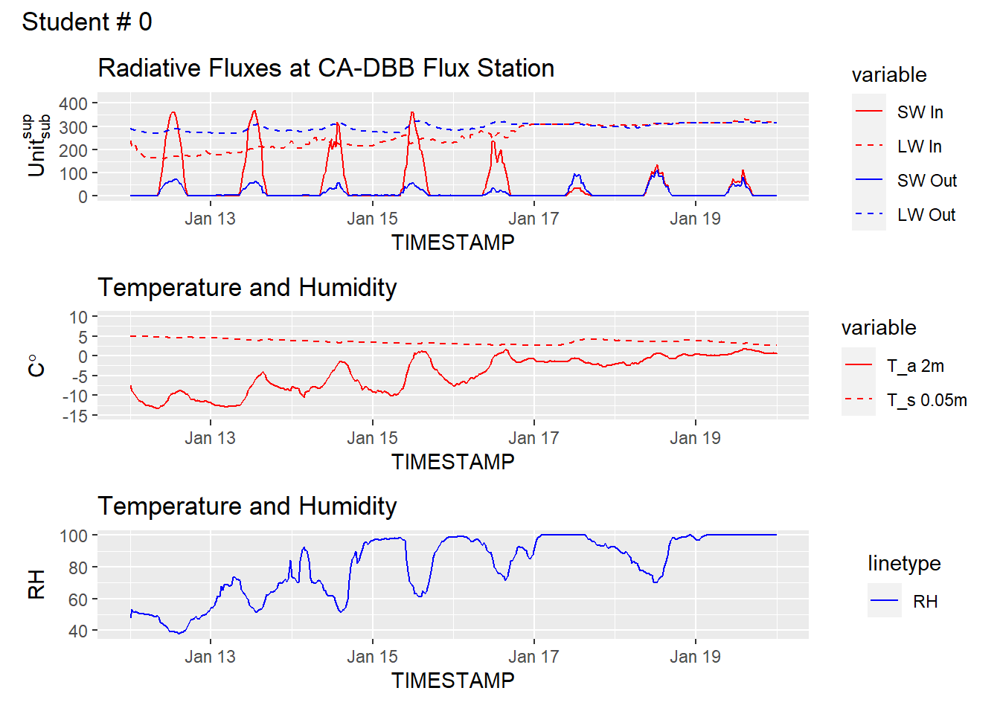

The code below will handle downloading and parsing your data for you, but if you are electing to complete the lab in excel or by hand, you can find the data [here](https://raw.githubusercontent.com/GEOS300/AssignmentData/main/Climate_Summary_BB.csv).  **Note** these data are in .csv format.  If you plan to work in excel, you should save a copy of the data in a suitable excel format (e.g., .xlsx) before making any charts or doing any calculations.


In your virtual field visit you will see the radiation measurement site at Totem Field and discuss the way the instruments are deployed over the grass. You will use data from this site for your first assignment. 


Using the link below you will be provided with data from a single day (the actual day is selected based on your student number, as shown on the webpage). Data are available for download in various formats:


In the files you will find measurements of the following variables: incoming and reflected short-wave radiation ($SW_{\downarrow}$, $SW_{\uparrow}$), incoming and outgoing long-wave radiation ($LW_{\downarrow}$, $LW_{\uparrow}$), air temperature ($T_a$) and relative humidity ($RH$). All measurements are from the set-up on CA-DBB (aka. BB1) Eddy Covariance station in Burns Bog.

Instructions: Please upload your answers including calculations, discussions and graphs in a single, well-structured report (either Word, PDF or HTML file). Note that you can download your .ipynb file under 'File $\gg$ Download as $\gg$ HTLM or PDF via Latex'. Label the report document with your name, your student number, the course and year. Upload your answers to Canvas by \underline{Monday, Feb 6, 2023, 11:59 pm}. Do not attach a spreadsheet. 

Marks are indicated in square brackets. In total, there are 50 marks. This assignment is worth 10\% of the final course grade and requires a substantial time commitment.


Import the necessary packages.  This code block below should (fingers crossed) check if you have packages installed and install them for you if not.

::: {.cell}

```{.r .cell-code}
#|echo: True

list.of.packages <- c("ggplot2", "reshape2","latex2exp")
new.packages <- list.of.packages[!(list.of.packages %in% installed.packages()[,"Package"])]
if(length(new.packages)) install.packages(new.packages)
library("reshape2")
library("ggplot2")
library("latex2exp")
```
:::


### Question 1 

Download and parse your data.  If you are using excel or doing calculations by hand (see instructions above).  Otherwise review the code block below.  We downloading the .csv file containing climate data from the CA-DBB flux station and formatting it to suit our needs.

Using the "head" command, you can get a preview of the first part of your dataset.  What value do you see listed for Incoming $SW$ in the first row of the table and why does it have this value?  Make suer to specify the units in your answer.

* Check the metadata provided [here](https://github.com/GEOS300/AssignmentData/blob/main/Climate_Summary_BB_Metadata.md) to make sure you understand the variable names and units.


::: {.cell}

```{.r .cell-code}
#|echo: True

df <- read.csv(file = 'https://raw.githubusercontent.com/GEOS300/AssignmentData/main/Climate_Summary_BB.csv')
df[['TIMESTAMP']] <- as.POSIXct(df[['TIMESTAMP']],format = "%Y-%m-%d %H%M")

head(df)
```

::: {.cell-output .cell-output-stdout}

```
            TIMESTAMP SW_IN_1_1_1 LW_IN_1_1_1 SW_OUT_1_1_1 LW_OUT_1_1_1
1 2022-01-01 00:30:00  0.05977540    263.2279    1.3582480     271.2144
2 2022-01-01 01:00:00  0.01990683    265.9375    1.1015637     274.9786
3 2022-01-01 01:30:00  0.10298067    268.3632    0.6146293     279.2283
4 2022-01-01 02:00:00  0.02578117    273.8807    0.3941725     281.6006
5 2022-01-01 02:30:00  0.03268367    277.7110    0.3813828     283.5396
6 2022-01-01 03:00:00  0.03338333    277.2797    0.3865185     284.4536
           H       G_1  TA_1_1_1  TA_1_2_1     TS_1     TS_2     TS_3 RH_1_1_1
1 -29.676018 -5.586875 -7.762711 -9.570630 3.630083 4.214648 7.489783 83.28255
2         NA -5.553178 -7.200051 -9.533210 3.677612 4.251830 7.531122 82.64555
3         NA -5.575220 -6.349798 -7.833451 3.669683 4.264247 7.550878 79.34940
4         NA -5.574099 -6.297862 -7.050872 3.692943 4.280375 7.569431 79.83266
5         NA -5.562795 -6.020581 -6.729948 3.708760 4.293371 7.578785 79.85045
6  -6.500002 -5.563889 -5.811514 -6.359775 3.698611 4.284091 7.576676 79.45928
  P_1_1_1 PA_1_1_1  WS_1_1_1  WD_1_1_1 VPD_1_1_1
1       0 102.3971 0.6597374 0.6597374 0.5728984
2       0 102.4034 1.4010231 1.4010231 0.6211866
3       0 102.4177 1.6921777 1.6921777 0.7891113
4       0 102.4485 1.8559053 1.8559053 0.7737166
5       0 102.4614 2.0136266 2.0136266 0.7896050
6       0 102.4637 2.0015748 2.0015748 0.8178825
```


:::
:::

### Question 2 

In the example below - we are plotting traces of the four radiation components for the January 2024 cold-snap and snowstorm (Jan 12 to Jan 19).  Looking at the trace below - what stands out to you?  Comment on each component over time.  Do you see any issues in the data?


::: {.cell}

```{.r .cell-code}
Start ='2024-01-12 0000'
End ='2024-01-19 2359'

Selection <- df[which((df$TIMESTAMP >= Start) & (df$TIMESTAMP <=End)),]


df_to_plot <- melt(
  Selection[,c('TIMESTAMP','SW_IN_1_1_1','LW_IN_1_1_1','SW_OUT_1_1_1', 'LW_OUT_1_1_1')],
  id="TIMESTAMP")
  
p <- ggplot(df_to_plot, aes(x = TIMESTAMP, y = value, group = variable)) +
  geom_line(aes(color = variable,linetype = variable)) +
  scale_color_manual(labels = c('SW In','LW In','SW Out','LW Out'),values = c('red','red','blue','blue')) +
  scale_linetype_manual(labels = c('SW In','LW In','SW Out','LW Out'), values = c("solid","dashed","solid","dashed"))+
  labs(y = TeX('Units^{superscript}^{subscript}'))+
  ylim(0,425)+
  ggtitle('Radiative Fluxes at CA-DBB Flux Station\nStudent #')
# 
p
```

::: {.cell-output-display}
{width=672}
:::
:::

### Question 3 

Using the example above as a template, plot the 4 component radiation for your assigned day.  Additionally, calculate $R_n$ and plot it on your chart as a solid black line.


::: {.cell}

```{.r .cell-code}
# Insert your code here
```
:::

