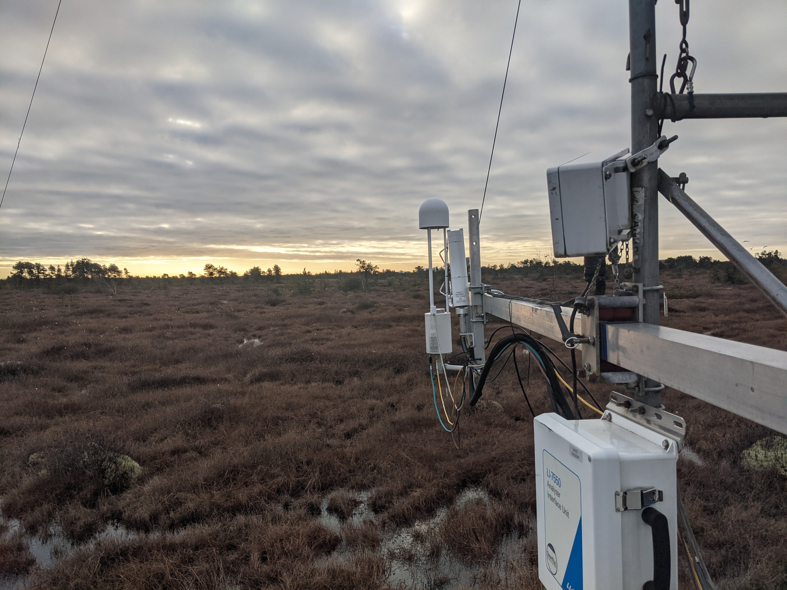
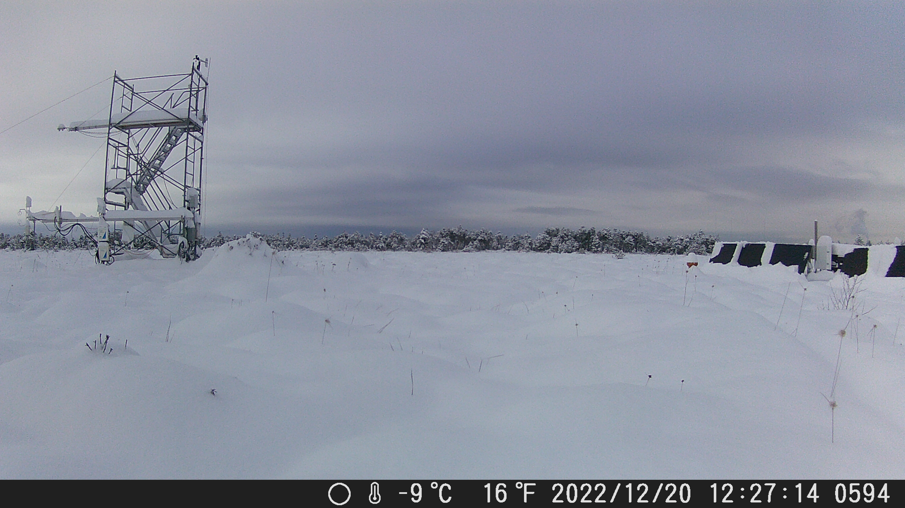
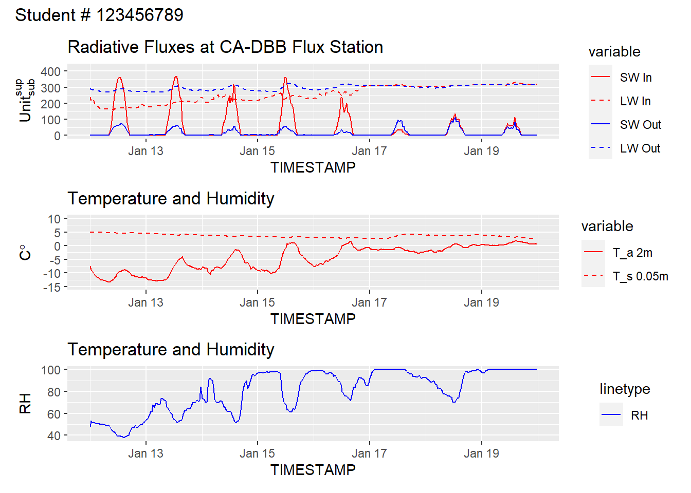
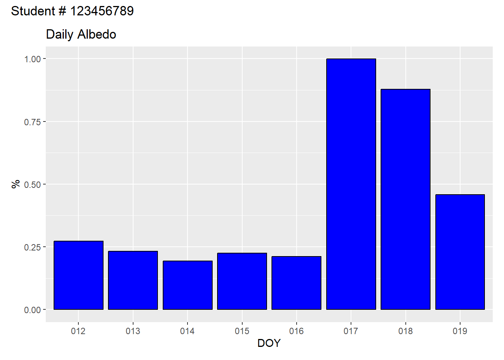

[Python and R code templates be found here](https://github.com/GEOS300/Assignment01) to help get you started.


## Instructions

It is strongly recommended that you complete the assignment in Python or R, although you can complete it in excel/numbers if necessary.  They will download the data for you and get you started with a few blocks of code to make plots and tables.  If you are electing to complete the lab in excel, you can find all the relevant data files here [here](https://github.com/GEOS300/AssignmentData/).  **Note** these data are in .csv format.  If you plan to work in excel, you should save a copy of the data in a suitable excel format (e.g., .xlsx) before making any charts or doing any calculations.

Please upload your answers including all calculations, discussions, tables, and graphs in a single document (PDF or HTML file). Note that you can download your .ipynb file under 'File $\gg$ Download as $\gg$ HTLM or PDF via Latex' and submit this as your report. Label the report document with your name and your student number. Upload your answers to Canvas. **Do not attach a spreadsheet.**

**Make Sure** your student number is include on each plot you produce, and that each plot is using the correct units.


## CA DBB Flux Station

In this lab, assignment, you're going to look at data from the CA-DBB (aka "BB") Eddy Covariance (EC) Station located in Delta, BC.  On the [assignment data page](https://github.com/GEOS300/AssignmentData) you can find a Climate_Summary_BB.csv with data from the CA-DBB station along with two metadata files, one describing the climate data and another describing the station.  Reviewing the metadata is an important first step of any project.

:::: {.columns}

@fig-BB1 shows some pictures of the site from different perspectives.  @fig-map shows an interactive web map with high resolution satellite imagery.  Clicking on "BB" in   will zoom to the CA-DBB station and show the site's "Flux Footprint Climatology", which is a concept we'll cover later in term.  For now, we'll stick to looking at some basic components of the site's energy balance.  Clicking the "BB" button again will toggle the footprint later on and off.  You can pan/zoom to get a feel for what the site looks like. 

::: {#fig-BB1 layout-ncol=2}

{#fig-BB1-RAD}

{#fig-BB1-EC}

{#fig-BB1-Snow}

{#fig-BB1-East}


:::

::: {#fig-map}

<div style="overflow: hidden;
  padding-top: 55%;
  position: relative">
<iframe src="https://ubc-micromet.github.io/FieldSiteMaps/" title="Processes" scrolling="no" frameborder="0"
style="border: 0;
height: 100%;
left: 0;
position: absolute;
top: 0;
width: 75%;">
</iframe>
</div>
Location of UBC-Micromet Eddy Covariance Stations
:::

::::


---


### Question 1 

Below is an example showing the first few rows of the BB climate summary data.  What values do you see listed for Incoming and outgoing $SW$ in the first row of the table, are these values reasonable?  Why or why not?  

* Make suer to specify the units in your answer. Check the metadata provided [here](https://github.com/GEOS300/AssignmentData/blob/main/Climate_Summary_BB_Metadata.md) to make sure you understand the variable names and units.


::: {.cell}

```{.r .cell-code}
# Import the data from github & parse the timestamp for each record
data_url='https://raw.githubusercontent.com/GEOS300/AssignmentData/main/Climate_Summary_BB.csv'
df <- read.csv(file = data_url)

# We have to parse the timestamp explicitly to convert it to a "time aware" object
df$TIMESTAMP <- as.POSIXct(df$TIMESTAMP,format = "%Y-%m-%d %H%M")
# Using this we can get a extra variables (DOY & HOUR) that will be helpful later
df$HOUR <- format(df$TIMESTAMP,format = "%H")
df$DOY <- format(df$TIMESTAMP,format = "%j")

# Calculate Albedo
df$Albedo = df$SW_OUT_1_1_1/df$SW_IN_1_1_1

# Preview the table using head()
head(df)
```

::: {.cell-output .cell-output-stdout}

```
            TIMESTAMP SW_IN_1_1_1 LW_IN_1_1_1 SW_OUT_1_1_1 LW_OUT_1_1_1
1 2022-01-01 00:30:00  0.05977540    263.2279    1.3582480     271.2144
2 2022-01-01 01:00:00  0.01990683    265.9375    1.1015637     274.9786
3 2022-01-01 01:30:00  0.10298067    268.3632    0.6146293     279.2283
4 2022-01-01 02:00:00  0.02578117    273.8807    0.3941725     281.6006
5 2022-01-01 02:30:00  0.03268367    277.7110    0.3813828     283.5396
6 2022-01-01 03:00:00  0.03338333    277.2797    0.3865185     284.4536
           H       G_1  TA_1_1_1  TA_1_2_1     TS_1     TS_2     TS_3 RH_1_1_1
1 -29.676018 -5.586875 -7.762711 -9.570630 3.630083 4.214648 7.489783 83.28255
2         NA -5.553178 -7.200051 -9.533210 3.677612 4.251830 7.531122 82.64555
3         NA -5.575220 -6.349798 -7.833451 3.669683 4.264247 7.550878 79.34940
4         NA -5.574099 -6.297862 -7.050872 3.692943 4.280375 7.569431 79.83266
5         NA -5.562795 -6.020581 -6.729948 3.708760 4.293371 7.578785 79.85045
6  -6.500002 -5.563889 -5.811514 -6.359775 3.698611 4.284091 7.576676 79.45928
  P_1_1_1 PA_1_1_1  WS_1_1_1  WD_1_1_1 VPD_1_1_1 HOUR DOY    Albedo
1       0 102.3971 0.6597374 0.6597374 0.5728984   00 001 22.722525
2       0 102.4034 1.4010231 1.4010231 0.6211866   01 001 55.335956
3       0 102.4177 1.6921777 1.6921777 0.7891113   01 001  5.968395
4       0 102.4485 1.8559053 1.8559053 0.7737166   02 001 15.289165
5       0 102.4614 2.0136266 2.0136266 0.7896050   02 001 11.668912
6       0 102.4637 2.0015748 2.0015748 0.8178825   03 001 11.578188
```


:::
:::


::: {.cell}

```{.r .cell-code}
# Insert your code or text answer here.  If writing a text answer in .ipynb, change the cell type to Markdown.  If writing a text answer in .Rmd, just delete the tick marks surrounding the block
```
:::


### Question 2 

We're going to be looking at some data from the January 2024 cold-snap (Jan 12 to Jan 19) and snowstorm (Jan 17-Jan 19) during which record low temperatures were observed and over 25cm of snow was received across the Metro Vancouver area.  The table below shows some descriptive statistics for key variables during this time period.  What was the range of air temperatures observed over this time period?  How does it compare to the range of soil temperatures observed?


::: {.cell}

```{.r .cell-code}
# Set a time window and query the dataframe
Start ='2024-01-12 0000'
End ='2024-01-20 0000'

# Select a subset of the variables
Query.Cols <- c('TIMESTAMP','DOY','HOUR','SW_IN_1_1_1','LW_IN_1_1_1','SW_OUT_1_1_1', 'LW_OUT_1_1_1','TA_1_1_1','TS_1','RH_1_1_1')

# Run the query and save it to a new dataframe called "Selection"
Selection <- df[which((df$TIMESTAMP >= Start) & (df$TIMESTAMP <End)),
        Query.Cols]

# Generate some descriptive statistics for the data (excluding the timestamp)
summary(subset(Selection,select = -TIMESTAMP))
```

::: {.cell-output .cell-output-stdout}

```
     DOY                HOUR            SW_IN_1_1_1        LW_IN_1_1_1   
 Length:384         Length:384         Min.   :  0.0000   Min.   :161.6  
 Class :character   Class :character   1st Qu.:  0.0000   1st Qu.:215.1  
 Mode  :character   Mode  :character   Median :  0.0275   Median :249.9  
                                       Mean   : 45.2556   Mean   :255.8  
                                       3rd Qu.: 40.2896   3rd Qu.:308.0  
                                       Max.   :369.3406   Max.   :330.5  
  SW_OUT_1_1_1      LW_OUT_1_1_1      TA_1_1_1            TS_1      
 Min.   :  0.000   Min.   :269.1   Min.   :-13.297   Min.   :2.607  
 1st Qu.:  1.267   1st Qu.:282.2   1st Qu.: -8.566   1st Qu.:3.086  
 Median :  2.698   Median :299.1   Median : -2.880   Median :3.555  
 Mean   : 14.706   Mean   :296.8   Mean   : -4.576   Mean   :3.597  
 3rd Qu.: 18.668   3rd Qu.:310.9   3rd Qu.: -0.607   3rd Qu.:3.979  
 Max.   :114.190   Max.   :323.1   Max.   :  1.805   Max.   :4.984  
    RH_1_1_1     
 Min.   : 37.67  
 1st Qu.: 65.42  
 Median : 88.57  
 Mean   : 80.75  
 3rd Qu.: 98.25  
 Max.   :100.00  
```


:::
:::


::: {.cell}

```{.r .cell-code}
# Insert your code or text answer here.  If writing a text answer in .ipynb, change the cell type to Markdown.  If writing a text answer in .Rmd, just delete the tick marks surrounding the block
```
:::


### Question 3

The plot below shows traces of the four radiation component, air & soil temperature, and relative humidity are.  Looking at the plot, what stands out to you?  Comment on the progression of each radiative component over time, using the temperature and humidity data to support your discussion and help explain any patterns you might see.  Do you see any issues in the data?  If so, what is a possible explanation?


::: {.cell}

```{.r .cell-code}
# Create a plot with three sub-plots
# Plot the radiation components on the first sub-plot
# Plot Ta and Ts on the second sub-plot, and RH on the third
plot_radiation <- melt(
  Selection[,c('TIMESTAMP','SW_IN_1_1_1','LW_IN_1_1_1','SW_OUT_1_1_1', 'LW_OUT_1_1_1')],
  id="TIMESTAMP")

p1 <- ggplot(plot_radiation, aes(x = TIMESTAMP, y = value, group = variable)) +
  geom_line(aes(color = variable,linetype = variable)) +
  scale_color_manual(labels = c('SW In','LW In','SW Out','LW Out'),values = c('red','red','blue','blue')) +
  scale_linetype_manual(labels = c('SW In','LW In','SW Out','LW Out'), values = c("solid","dashed","solid","dashed"))+
  
  # Note: You can use a markup language called LaTeX to format labels.  Replace Units,subscript, and superscript with the appropriate unit for radiative fluxes
  labs(y = TeX(r"($Unit_{sub}^{sup}$)"))+
  ylim(0,425)+
  ggtitle('Radiative Fluxes at CA-DBB Flux Station')

plot_temp <- melt(
  Selection[,c('TIMESTAMP','TA_1_1_1','TS_1')],
  id="TIMESTAMP")
p2 <- ggplot(plot_temp, aes(x = TIMESTAMP, y = value, group = variable)) +
  geom_line(aes(color = variable,linetype = variable)) +
  scale_color_manual(labels = c('T_a 2m','T_s 0.05m'),values = c('red','red')) +
  scale_linetype_manual(labels = c('T_a 2m','T_s 0.05m'), values = c("solid","dashed"))+
  labs(y = TeX(r"($C\degree)"))+
  ylim(-15,10)+
  ggtitle('Temperature and Humidity')

p3 <- ggplot(Selection, aes(x = TIMESTAMP, y = RH_1_1_1,lty = 'RH')) +
  geom_line(color='blue') +
  labs(y = 'RH')+
  ggtitle('Temperature and Humidity')


p1 / p2 / p3 + plot_annotation(sprintf('Student # %i',Student.Number))
```

::: {.cell-output-display}
{width=672}
:::

```{.r .cell-code}
options(repr.plot.width=8, repr.plot.height=10)
```
:::


::: {.cell}

```{.r .cell-code}
# Insert your code or text answer here.  If writing a text answer in .ipynb, change the cell type to Markdown.  If writing a text answer in .Rmd, just delete the tick marks surrounding the block
```
:::


### Question 4

The plot below shows mean daily albedo.  What explains sharp increase on the 17th?


::: {.cell}

```{.r .cell-code}
# Create a single plot bar showing mean daily albedo

# Calculate Albedo
Selection$Albedo = Selection$SW_OUT_1_1_1/Selection$SW_IN_1_1_1

# Filter out implausible values
Selection$Albedo = replace(Selection$Albedo, Selection$SW_OUT_1_1_1>Selection$SW_IN_1_1_1 , NaN )

# Resample to get mean daily Albedo, ignoring the NaN values
DailyAlbedo<-ddply(Selection,.(DOY),summarise, Albedo=mean(Albedo,na.rm=TRUE))

p <- ggplot(data=DailyAlbedo, aes(x=DOY, y=Albedo)) +
  geom_bar(stat="identity", color="black", fill="blue")+
  labs(y = '%')+
  ggtitle('Daily Albedo')
p + plot_annotation(sprintf('Student # %i',Student.Number))
```

::: {.cell-output-display}
{width=672}
:::
:::


::: {.cell}

```{.r .cell-code}
# Insert your code or text answer here.  If writing a text answer in .ipynb, change the cell type to Markdown.  If writing a text answer in .Rmd, just delete the tick marks surrounding the block
```
:::


## Question 5

The maximum half-hourly $SW_\downarrow$ observed during this time period occurred between 12:30 and 13:00 on January 13th.  Using the equations from lecture, calculate the Local Apparent Time (LAT), solar declination $\delta$, solar zenith angle $Z$, and extraterrestrial irradiance $I_ex$ for the center point of this observation period (12:45).  Given the value of $I_ex$, compared to observed $SW_\downarrow$, what is the approximate bulk transmissivity ($\Psi_a$) coefficient of the atmosphere over CA-DBB at this point in time?  Given the value of $I_ex$, compared to observed $SW_\downarrow$, what is the approximate bulk transmissivity ($\Psi_a$) coefficient of the atmosphere over CA-DBB at this point in time?  

**Note**: you can find the site's Lat/Lon and time zone info in the CA-DBB station metadata file.


::: {.cell}

```{.r .cell-code}
# Insert your code or text answer here.  If writing a text answer in .ipynb, change the cell type to Markdown.  If writing a text answer in .Rmd, just delete the tick marks surrounding the block
```
:::


### Question 6

Now calculate $\Psi_a$ for 12:45 January 19; the observed value of $SW_\downarrow$ was between 12:30 and 13:00 was 58.375 W$^m{-2}$.  What explains the difference between these two days?


::: {.cell}

```{.r .cell-code}
# Insert your code or text answer here.  If writing a text answer in .ipynb, change the cell type to Markdown.  If writing a text answer in .Rmd, just delete the tick marks surrounding the block
```
:::


### Question 7

Using the examples above as a template, calculate $R_n$ over the cold-snap.  Make a scatter plot showing $R_n$ on the y-axis and $SW_\downarrow$ on the x-axis.  Describe the relationship you.


::: {.cell}

```{.r .cell-code}
# Create a scatter plot

# p <- ggplot(Selection, aes(x=TA_1_1_1, y=TS_1)) + geom_point()
# p + plot_annotation(sprintf('Student # %i',Student.Number))
```
:::


::: {.cell}

```{.r .cell-code}
# Insert your code or text answer here.  If writing a text answer in .ipynb, change the cell type to Markdown.  If writing a text answer in .Rmd, just delete the tick marks surrounding the block
```
:::


### Question 8

Using the examples above as a template, create a new selection to see how typical summertime conditions compare to severe winter time conditions.  Change the selection period so that it spans July 12th to July 19th, 2023.  Provide summary statistics of the same variables as those shown above and produce plots like the ones shown above as well. Discuss how each of these variables during this mid-summer period compare to those from the cold-snap period.


::: {.cell}

```{.r .cell-code}
# Insert your code or text answer here.  If writing a text answer in .ipynb, change the cell type to Markdown.  If writing a text answer in .Rmd, just delete the tick marks surrounding the block
```
:::


::: {.cell}

```{.r .cell-code}
# Insert your code or text answer here.  If writing a text answer in .ipynb, change the cell type to Markdown.  If writing a text answer in .Rmd, just delete the tick marks surrounding the block
```
:::


### Question 9

Find the timestamp of the observation interval when maximum $SW_\downarrow$ was observed for the mid-summer period.  You will use observations from this timestamp to answer each of the questions below.  **Note** our sites do not use daylight savings, so the UTC offset is fixed all year.  Use this information to calculate $I_ex$ and $\Psi_a$ for the mid-point of this observation period.  Discus how these two values compare between this observation, and the observation spanning between 12:30 and 13:00 on January 13th of 2024.  How does the magnitude differ and why does the relative timing of the maximum daily $SW_\downarrow$ differ?


::: {.cell}

```{.r .cell-code}
# Code Tip: getting the time and value when a variable reaches it's maximum

# Selection[Selection$TA_1_1_1==max(Selection$TA_1_1_1), c('TIMESTAMP','TA_1_1_1')]
```
:::


::: {.cell}

```{.r .cell-code}
# Insert your code or text answer here.  If writing a text answer in .ipynb, change the cell type to Markdown.  If writing a text answer in .Rmd, just delete the tick marks surrounding the block
```
:::


### Question 10

Approximately 42% of the energy in the short-wave is within the PAR band (Photosynthetically active radiation that can be used by plants to perform photosynthesis). Based on this assumption, calculate the energy available to plants (also called: photosynthetic photon flux density, PPFD) at noon in $\mu \rm{mol}\, \rm{m}^{-2}\,\rm{s}^{-1}$. You can use the wavelength of yellow light ($\lambda 0 0.55 \mu m$) for your estimate.
**Hint**: Consult examples in reading package for radiation geometry.


::: {.cell}

```{.r .cell-code}
# Insert your code or text answer here.  If writing a text answer in .ipynb, change the cell type to Markdown.  If writing a text answer in .Rmd, just delete the tick marks surrounding the block
```
:::


### Question 11

Let's assume the surface emissivity at CA-DBB is $\epsilon = 0.95$.  Using this assumption and the Stephan Boltzman law for grey bodies, estimate temperature of the land surface at CA-DBB for the time period identified above in question 9.


::: {.cell}

```{.r .cell-code}
# Insert your code or text answer here.  If writing a text answer in .ipynb, change the cell type to Markdown.  If writing a text answer in .Rmd, just delete the tick marks surrounding the block
```
:::


### Question 12

Now use the same equation to estimate the "apparent" radiative sky temperature ($T_k$) from $LW_{\downarrow}$ for this timestamp.  "Apparent" means you should assume $\epsilon{a} = 1.0$. How would you interpret $T_k$?


::: {.cell}

```{.r .cell-code}
# Insert your code or text answer here.  If writing a text answer in .ipynb, change the cell type to Markdown.  If writing a text answer in .Rmd, just delete the tick marks surrounding the block
```
:::


### Question 13

Using measured $LW_{\downarrow}$ and measured air temperature $T_a$, calculate the actual bulk emissivity of the atmosphere $\varepsilon_{a}$ at noon? [2]


::: {.cell}

```{.r .cell-code}
# Insert your code or text answer here.  If writing a text answer in .ipynb, change the cell type to Markdown.  If writing a text answer in .Rmd, just delete the tick marks surrounding the block
```
:::


### Question 14

Using the Prata (1996) equation from lecture and measured $T_a$ and $RH$, what is the calculated apparent emissivity of the atmosphere and the calculated estimate of $LS_{\downarrow}$? How well do these approximations match with what we actually observed?


::: {.cell}

```{.r .cell-code}
# Insert your code or text answer here.  If writing a text answer in .ipynb, change the cell type to Markdown.  If writing a text answer in .Rmd, just delete the tick marks surrounding the block
```
:::

